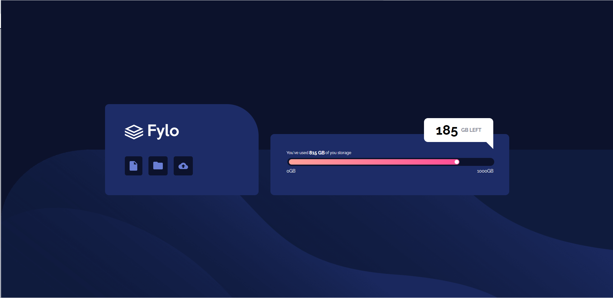

# Frontend Mentor - Fylo data storage component solution

## Table of contents

- [Overview](#overview)
  - [The challenge](#the-challenge)
  - [Screenshot](#screenshot)
  - [Links](#links)
- [My process](#my-process)
  - [Built with](#built-with)
  - [What I learned](#what-i-learned)
- [Author](#author)

## Overview

### The challenge

Users should be able to:

- View the optimal layout for the site depending on their device's screen size

### Screenshot



### Links

- Live Site URL: [https://csmurillo.github.io/frontend-mentor-fylo-data-storage](https://csmurillo.github.io/frontend-mentor-fylo-data-storage)

## My process

### Built with

- Semantic HTML5 markup
- CSS custom properties
- Flexbox
- CSS Grid
- Mobile-first workflow
- [React](https://reactjs.org/) - JS library
- [Next.js](https://nextjs.org/) - React framework
- [Styled Components](https://styled-components.com/) - For styles


### What I learned

This project taught me how to set width and height for a background-image. It also taught me to customize an input[range] which was quite difficult since many articles online did not have a range where the range track had an linear-gradient color. 

```css
.proud-of-this-css {
  background-image:url('/images/bg-mobile.png');
  background-size: 100% 50%;
}
```
```css
  .track-range-for-a-styled-component-css{
    z-index: 0;
    height: 14px;
    border-radius: 15px;
    position: absolute;
    left:6px;
    top: 9.5px;
    width: ${props => props.position+'%'};
    background: linear-gradient(to right, hsl(6, 100%, 80%), hsl(335, 100%, 65%));
    max-width:98.9%;
    padding-right:5px;
  }
```

## Author

- Frontend Mentor - [@csmurillo](https://www.frontendmentor.io/profile/csmurillo)


